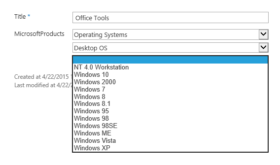
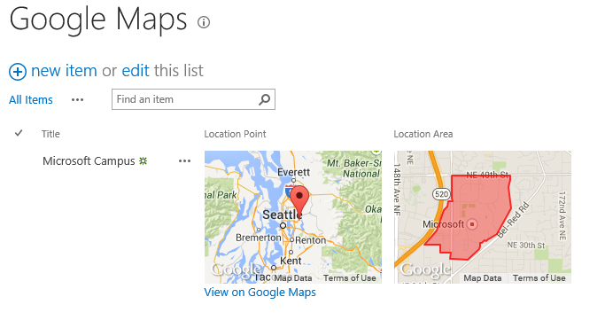
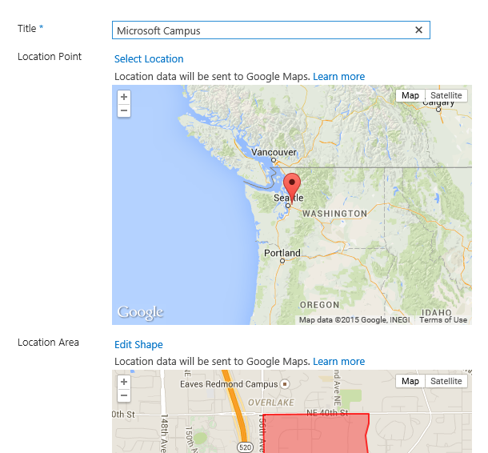
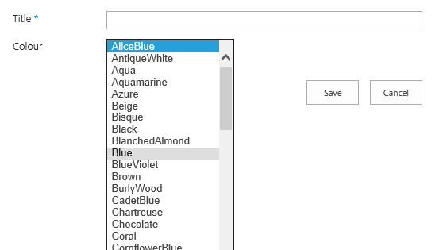
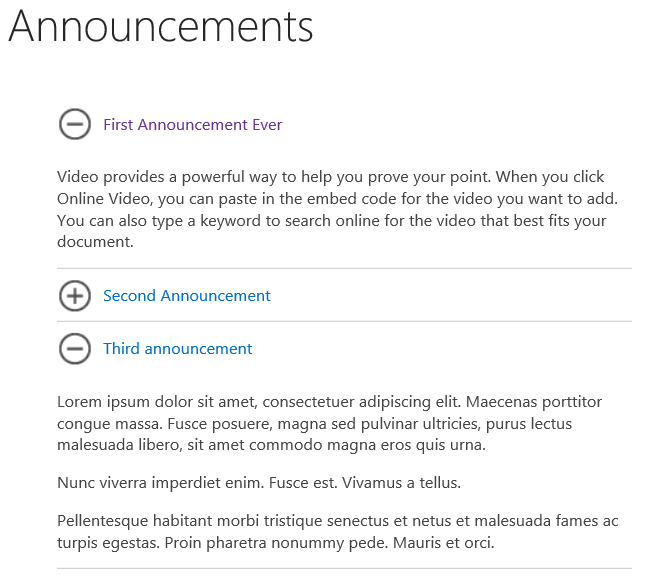

# JSLink Client Side Rendering (CSR) Samples  #

Jump To
* [Samples (including screenshots)](#jslink-samples)
* [The Re-Usable Framework](#reusable-framework)
* [Install Instructions](#install-instructions)
* [How to use JSLink](#how-to-use-jslink)

### Summary ###
The JSLink sample includes sample re-usable code which demonstrate how you can use the new Client Side Rendering techniques along with JSLink hooks to modify the rendering of List Forms and Views.

The download includes a Visual Studio 2013 solution which compiles to a SharePoint 2013 WSP Package. this includes both a set of sample re-usable frameworks for JSLink display templates, as well as various lists which demo the functionality.

Specifically functionality includes

* Rendering a single-select Taxonomy field as cascading drop-downs
* Rendering two related lookup fields as cascading Drop-Downs (single-select) or checkboxes (multi-select)
* Presenting a Google Maps interface for selecting points or areas on a map
* Sample Colour Picker with formatted display, custom editing (as drop-downs) and a sample validators

*More detail on these samples are included [below](#jslink-samples)*

### Applies to ###
-  SharePoint Online (All SKUs)
-  SharePoint Server 2013 (Standard and Enterprise)

### Prerequisites ###
None

### Solution ###
Solution | Author(s)
---------|----------
Branding.JSLink | Martin Hatch *(@martinhatch)*

### Version history ###
Version  | Date | Comments
---------| -----| --------
1.1  | May 30th 2015 | Added accordion view by Robrecht Van Caenegem
1.0  | April 22nd 2015 | Initial release

### Disclaimer ###
**THIS CODE IS PROVIDED *AS IS* WITHOUT WARRANTY OF ANY KIND, EITHER EXPRESS OR IMPLIED, INCLUDING ANY IMPLIED WARRANTIES OF FITNESS FOR A PARTICULAR PURPOSE, MERCHANTABILITY, OR NON-INFRINGEMENT.**

----------

# JSLink Samples #
This section describes each of the samples in more detail.

## Taxonomy Field - Cascading Dropdowns ##
This currently consists of a reusable library which allows you to convert a single-select Taxonomy (Managed Metadata) field and it renders it as a set of cascading drop-downs.

The drop-down values will automatically populate based on the hierarchy of the termset that the field is bound to. 

You can see below the field in action using a "Microsoft Products" term set (which is included in the source code of the sample)

## Related Lookup Fields - Cascading Dropdowns and Checkboxes ##
This sample consists of a reusable library where you can change the rendering of lookup fields.

I allows you to change how the views render (removing the clickable links on lookup fields, and changing the multi-select lookups to a list (instead of a ";" delimited block of text)

The editing interface allows you to perform cascading drop-downs (some limitations apply, see the [reusable framework(#reusable-framework) section below) and you can change a multi-select lookup to render as checkboxes.

## Google Maps fields ##
These can be applied to any text fields (for points) or multi-line text fields (for area selection).

This will automatically render thumbnail images in list views...

.. an inline editing experience showing a larger thumbnail ..

.. and dialogs allowing the editing to take place ..

## Colour Picker ##
This is a simple colour picker scenario with all of the HTML colours rendering in a drop-down list, with the actual colour being shown in the View and Display Form. 

..

This also includes an example of a "Validator" where you can control validation of data entry through the SharePoint CSR techniques

## Announcements Accordion ##
This is a sample that will transform your announcements list into an accordion.

You can apply the jslink onto an existing announcements list by changing the jslink property of the listview webpart to:
~sitecollection/Style Library/OfficeDevPnP/Branding.JSLink/jquery-1.10.2.min.js|~sitecollection/Style Library/OfficeDevPnP/Branding.JSLink/Generics/AnnouncementAccordion.js|~sitecollection/Style Library/OfficeDevPnP/Branding.JSLink/TemplateOverrides/AnnouncementAccordionView.js

Make sure that the list view includes the Body column.

# Reusable Framework #
Although this is a essentially a set of sample code, there are a number of reusable elements which you could use in your own solutions.

The solution contains two folders which are deployed to the Style Library under "\Style Library\OfficeDevPnP\Branding.JSLink\" which make up the "reusable" elements:
* Generics
* Pages

All of these use reusable methods to define the rendering and retrieval of values (using the field name and field Ids as the client ID for the various HTML elements) so that the values can be dynamically retrieved. This allows the **same template to be used multiple times in the same list** without them clashing with each other.

These contain the various rendering end-points which you can consume to modify the rendering behaviour of your list fields. All you need to do is provide the "Override" JavaScript code to tell SharePoint which fields need to be overridden, and which methods you are using to do the rendering.  

*In the sample, all of the overrides are contained in a separate folder called "TemplateOverrides" .. you can use these as examples to get you started*

The methods you can use are described in more detail in the sections below:

## Taxonomy Fields (jslinkTemplates.Taxonomy) ##
This can be bound to any **TaxonomyField** although currently only single-select values are supported.

* **jslinkTemplates.Taxonomy.editMode** - This can be bound to the NewForm or EditForm of any taxonomy field and will automatically render it as cascading drop-downs. It will dynamically pull the TermStore and TermSet from the field schema so no further configuration is required.

***Important Note - Taxonomy Fields cannot use the "JSLink" property on the field itself. Instead if using the actual Field.JSLink property apply it to the "Title" field within the same list, to make sure the JavaScript is executed*** 

## Google Maps (jslinkGoogleMaps) ##
This contains two namespaces, depending on whether you want to provide the ability to select a single point (**PointValue - Text field**) or define a spacial area (**SpacialValue - Note field**).

* **jslinkGoogleMaps.PointValue**
  * **jslinkGoogleMaps.PointValue.editForm** - Usable on NewForm and EditForm, allows the selection of the map point using a dialog. If the field has a current value then it will be displayed in a large panel.
  * **jslinkGoogleMaps.PointValue.displayForm** - Usable on the DisplayForm, shows a large panel with the map displayed.
  * **jslinkGoogleMaps.PointValue.view** - Usable on the View, shows a small thumbnail
 
* **jslinkGoogleMaps.SpacialValue**
  * **jslinkGoogleMaps.SpacialValue.editForm** - Usable on NewForm and EditForm, allows the selection of the map point using a dialog. If the field has a current value then it will be displayed in a large panel.
  * **jslinkGoogleMaps.PointValue.displayForm** - Usable on the DisplayForm, shows a large panel with the map displayed.
  * **jslinkGoogleMaps.PointValue.view** - Usable on the View, shows a small thumbnail

## Colour Picker (jslinkTemplates.Colours) ##
This can be bound to a field of type **Text** and converts it to a drop-down colour picker, with the colour selected shown in the display forms and views.

* **jslinkTemplates.Colours.display** - Use for DisplayForm and View, shows the current value as both a coloured box and the text value
* **jslinkTemplates.Colours.edit** - Use for NewForm and EditForm, shows a drop-down picker of available colours.

*Current implementation, as a demo for validators, contains a validator which stops selection of the colour blue*

## Lookup Fields (jslinkTemplates.Lookups) ##
These can be bound to fields of type **Lookup** and **LookupMulti** to change the rendering behaviour.

** Standard Lookup Field Rendering **
* **jslinkTemplates.Lookups.Generic.view** - Use for View. Will remove the clickable links. Dynamically changes between a single text value (for *Lookup*) or a list of values (for *LookupMulti*)
* **jslinkTemplates.Lookups.Generic.displayForm** - Use for DisplayForm. Will remove the clickable links. Dynamically changes between a single text value (for *Lookup*) or a list of values (for *LookupMulti*)
 
* **jslinkTemplates.Lookups.Generic.SingleItem.editForm** - Use for NewForm and EditForm. Render a Lookup as a drop-down box. *If using filtered lookups (below) this is required for the field you are filtering on .. to make sure the required IDs are in place for this value to be retrieved*
* **jslinkTemplates.Lookups.CheckBoxes.editForm** - Use for NewForm and EditForm. Render a *LookupMulti* as a (scrollable) list of Checkboxes.

**Filtered Lookups (e.g. Cascading Drop-Downs)**
* **jslinkTemplates.Lookups.Filtered.editForm** - Use for NewForm and EditForm. Allows the lookup field to filter itself based on the selection of another Lookup value on the same form. Will dynamically show either a Drop-down list (for *Lookup*) or Checkboxes (for *LookupMulti*).

This last one requires a bit more explanation. Lets take the "Project Locations" example from the included Samples. It contains three lookup fields each with different template overrides:
* Region : jslinkTemplates.Lookups.Generic.SingleItem.editForm
* Country : jslinkTemplates.Lookups.Filtered.editForm.bind(null, "Region")
* AssociatedCountries : jslinkTemplates.Lookups.Filtered.editForm.bind(null, "Region")

The *Country* and *AssociatedCountries* both specify the field they are filtering on (*Region*) through the *bind* command. 

The reason this works is because the *Countries* list (used as the lookup target for the *Country* and *AssociatedCountries* lists) also contains a Lookup field called *Region* (which looks up to the same lookup target as the *Region* field in this list).

The rendering method can therefore use the currently selected *Region* value to perform a filtered REST query to only pull back those list items in the *Countries* list which have the same *Region* value assigned! 

*Note - This only works because we are also using our own template override for the "Region" field here .. this allows the JavaScript code to pull the value of the "Region" field because we know the format (and expected ID) of the drop-down* 

# Install Instructions #

The source code contains a Visual Studio 2013 solution in which is a SharePoint 2013 project. This will package into a WSP No-Code-Sandbox-Solution (NCSS) which can be deployed to the Solution Gallery in either SharePoint Server 2013 (on-prem), SharePoint Online or any other cloud hosted SharePoint 2013 environment. 

Where practically possible the solution includes pre-provisioned SharePoint lists which demonstrate the sample functionality included in this release.  

When the solution is deployed there are three features which will be activated automatically:

**OfficeDev PnP - Branding.JSLink - Style Library Files** (*Site Collection Scoped*)
Provisions all of the JavaScript files to the Style Library in the relative path \OfficeDevPnP\Branding.JSLink\

**OfficeDevPnP - Branding.JSLink - Lists** (*Web Scoped*)
Creates the demo lists which showcase the sample functionality

**OfficeDevPnP - Branding.JSLink - jQuery** (*Web Scoped*)
Adds the jQuery framework to every page in the site. If you already have jquery in your environment then you can deactivate this

After deployment you should find that the following sample lists have been created in the root site of the site collection:

* A few of my favourite colours (showcases the colour picker)
* Regions (lookup target)
* Countries (lookup target)
* Project Locations (showcases cascading lookups and lookup rendering - uses lookups to the Regions and Countries lists)
* Google Maps (showcases the Google Maps functionality)

At the moment th Announcments View and Taxonomy samples need to be manually created after deployment (more details on that can be found in the [Samples](#jslink-samples) section above.

# How to use JSLink #

**Coming Soon**
